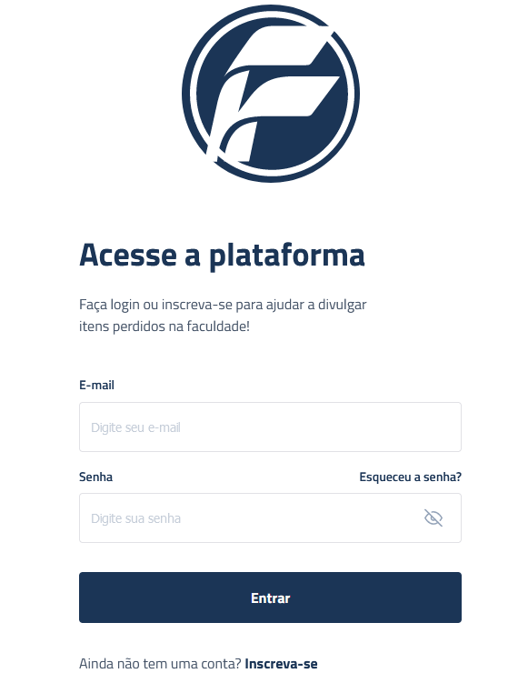

# 

  

Você pode visualizar o projeto através [DESSE LINK](https://gleizioliveira.github.io/Projeto-portifolio-achado-e-perdidos/). 

## 🚀 Tecnologias

Esse projeto foi desenvolvido com as seguintes tecnologias:

- HTMLc CSS e JavaScript
- Git e Github 
- Figma

## 💻 

## 🔖 Layout

Você pode visualizar o layout do projeto através [DESSE LINK](https://www.figma.com/community/file/1259999864699821079/Achados--da-FAM). É necessário ter conta no [Figma](https://figma.com) para acessá-lo.

## 
